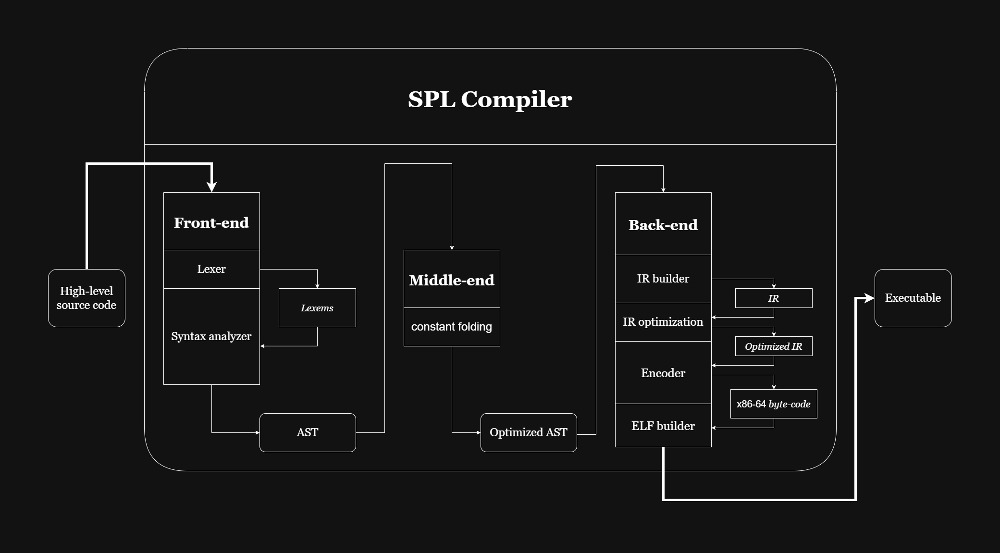
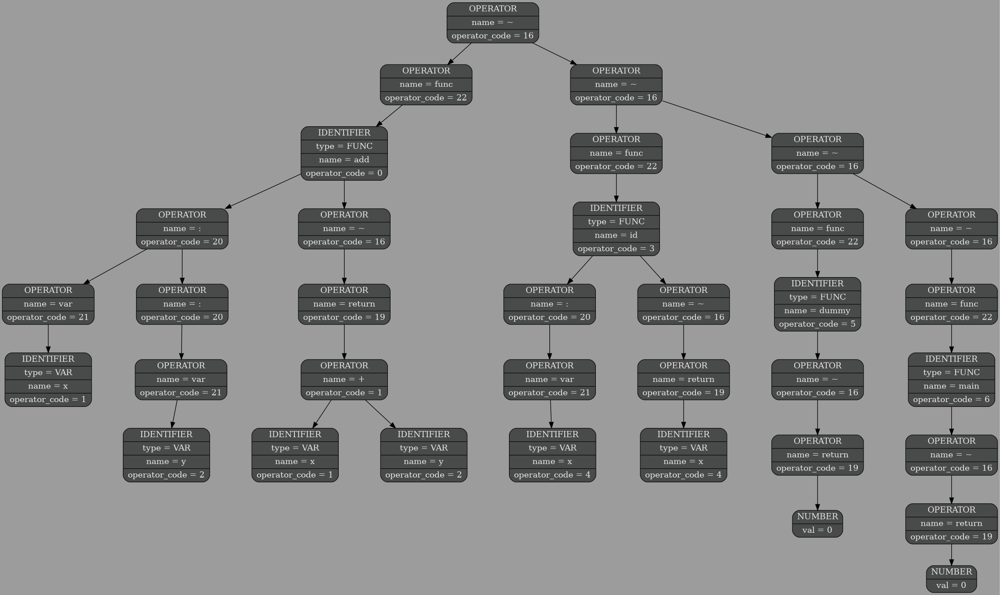
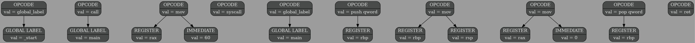
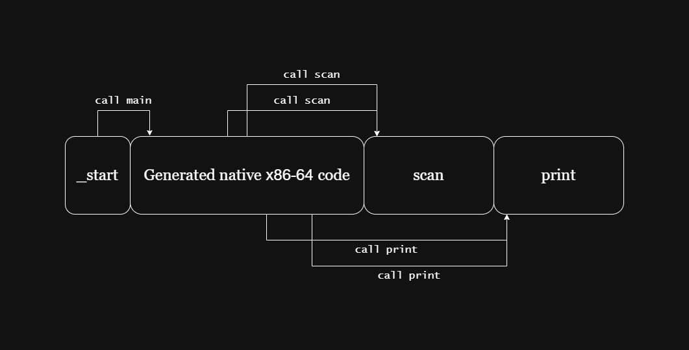

# Компилятор для языка программирования SPL

[]()
[]()
[]()

**SPL** (*Simple* *Programming* *Language*) — C-подобный язык программирования со своим компилятором, написанным с нуля. Компилятор заточен под архитектуру x86-64, реализует полный цикл обработки кода: от лексического анализа до генерации исполняемого ELF файла.

## Установка и запуск

Для сборки необходимо ввести в терминал:

```bash
git clone https://github.com/sevaphasol/compiler.git
cd compiler
make
```

Для запуска:

```bash
./run.sh <input-file> [output-file]
```

## Синтаксис

|Название оператора|Значение оператора              |
|:----------------:|:------------------------------:|
|func              |новая функция                   |
|var               |новая переменная                |
|call              |вызов функции                   |
|exit              |завершение работы программы     |
|print             |вывод числа в терминал          |
|scan              |ввод числа из терминала         |
|:                 |перечисление аргументов функции |
|~                 |ставится перед каждым оператором|

<details>
    <summary>Пример программы, вычисляющей и выводящий факториал вводимого числа.</summary>

```c
~ func factorial(: var n) {
    ~ if (n) {
        ~ return n * call factorial(: n - 1)
    }

    ~ return 1
}

~ func main() {
    ~ var test = 0
    ~ scan(: test)

    ~ print(: call factorial (: test))

    ~ return 0
}
```

</details>

<details>
    <summary>Пример программы, вычисляющей и выводящей первые n чисел Фибоначчи. n берётся из stdin.</summary>

```c
~ func factorial(: var n) {
    ~ if (n) {
        ~ return n * call factorial(: n - 1)
    }

    ~ return 1
}

~ func main() {
    ~ var test = 0
    ~ scan(: test)

    ~ print(: call factorial (: test))

    ~ return 0
}
```

</details>

## Архитектура компилятора

<div align="center">
    <br>
    
    <br>
    <strong>Принцип работы компилятора SPL</strong><br><br>
</div>

Компиляция состоит из трёх основных этапов:

### 1. Front-end: Исходный код → AST
На этом этапе происходит:
- **Лексический анализ (Lexer)**
  Преобразует исходный код в список токенов (*lexems*).
- **Синтаксический анализ (Syntax Analyzer)**
  Строит абстрактное синтаксическое дерево (AST) из токенов.

### 2. Middle-end: AST → Оптимизированное AST
Анализ и оптимизация абстрактного синтаксического дерева:
- **Constant Folding**
    Вычисление константных выражений на этапе компиляции.

### 3. Back-end: AST → IR → Машинный код x86-64
Финальная фаза генерации и вывода:
- **IR Builder**<br> &emsp;
    Перевод AST в промежуточное представление (IR).
- **IR Optimizer** <br> &emsp;
    Проведение оптимизаций на уровне IR.
- **Encoder** <br> &emsp;
    Генерация нативного x86-64 машинного кода из IR.
- **ELF Builder** <br> &emsp;
  Создание исполняемого файла формата ELF на основе сгенерированного байт-кода.

Здесь необходимо упомянуть то, что обычно IR создаётся ещё на этапе **Front-end** и именно он, а не AST передаётся между различными частями программы.

## Формат AST

AST является результатом работы **Front-end** и **Middle-end**. Хранится в виде текстового файла.

<details>
    <summary>Программа, дамп AST которой изображен ниже.</summary>

```c
~ func add(: var x : var y) {
    ~ return (x + y)
}

~ func id(: var x) {
    ~ return x
}

~ func dummy() {
    ~ return 0
}

~ func main() {
    ~ return 0
}
```

</details>

<div align="center">
    <br>
    
    <br>
    <strong>Графический дамп AST</strong><br><br>
</div>

<details>
    <summary>Пример AST.</summary>

```txt
7
{ 3   add        2 1 2  }
{ 1   x          1 0 0  }
{ 1   y          1 0 0  }
{ 2   id         2 1 1  }
{ 1   x          1 0 0  }
{ 5   dummy      2 1 0  }
{ 4   main       2 1 0  }

53
{1 16 {1 22 {3 0 {1 20 {1 21 {3 1  _  _ }  _ } {1 20 {1 21 {3 2  _  _ }  _ }  _ } } {1 16 {1 19 {1 1 {3 1  _  _ } {3 2  _  _ } }  _ }  _ } }  _ } {1 16 {1 22 {3 3 {1 20 {1 21 {3 4  _  _ }  _ }  _ } {1 16 {1 19 {3 4  _  _ }  _ }  _ } }  _ } {1 16 {1 22 {3 5  _ {1 16 {1 19 {2 0  _  _ }  _ }  _ } }  _ } {1 16 {1 22 {3 6  _ {1 16 {1 19 {2 0  _  _ }  _ }  _ } }  _ }  _ } } } }
```

</details>

В начале файла находится таблица имён, в которой хранится информация о всех переменных и функциях в программе. Далее идёт само дерево AST.

## Формат IR

IR по сути представляет собой язык ассемблера в удобном для работы формате. Можно было генерировать байт-код прямо из AST, но тогда было бы много инструкций вида push pop. Поэтому было принято решение сделать IR, которое решит данную проблему.

<details>
    <summary>Программа, дамп IR которой изображен ниже.</summary>

```c
~ func main() {
    ~ return 0
}
```

</details>

<div align="center">
    <br>
    
    <br>
    <strong>Графический дамп IR</strong><br><br>
</div>

## Поддержка print и scan

Операции print и scan реализованы в виде вызова функций из статически-линкуемой библиотеки.

<div align="center">
    <br>
    
    <br>
    <strong>Вызов функций print и call</strong><br><br>
</div>

<details>
    <summary>Реализация print на ассемблере.</summary>

```asm
section .text

print:
        mov eax, [rsp + 8] ; number is in the stack

        sub rsp, 16
        mov rsi, rsp ; start of buffer
        add rsi, 15  ; end of buffer

        pxor xmm0, xmm0 ; zeroing buffer
        movdqu [rsp], xmm0

        xor ebx, ebx
        test eax, eax
        jns .positive

.negative:
        neg eax
        inc ebx ; ebx = 1 — means negative

.positive:
        mov ecx, 10 ; ecx = divider

.convert_loop:
        xor edx, edx
        div ecx ; eax = eax / 10, edx = eax % 10
        dec rsi
        add dl, '0'
        mov [rsi], dl
        test eax, eax
        jnz .convert_loop

        test ebx, ebx
        jz .print_buffer

.add_minus:
        dec rsi
        mov byte [rsi], '-'

.print_buffer:
        mov rdi, rsi ; rdi = start of buffer

.find_end:
        cmp byte [rdi], 0
        je .found_end
        inc rdi
        jmp .find_end

.found_end:
        mov byte [rdi], 0x0a ; '\n'

        lea rdx, [rdi + 1]
        sub rdx, rsi ; rdx = buffer size

        mov rax, 1 ; sys_write
        mov rdi, 1 ; stdout
        syscall

        add rsp, 16
        ret
```

</details>

<details>
    <summary>Реализация scan на ассемблере.</summary>

```asm
section .text

scan:
        sub rsp, 16
        mov rsi, rsp ; start of buffer
        mov rdx, 16  ; buffer size

.read_input:
        mov rax, 0 ; sys_read
        mov rdi, 0 ; stdin
        syscall

        test rax, rax ; check status
        jle .done

.read_int:
        xor rax, rax ; result
        xor rbx, rbx ; sign of minus
        xor rcx, rcx ; counter

.check_sign:
        cmp byte [rsi], '-'
        jne .parse_loop

.negative:
        inc rcx
        inc rbx ; rbx = 1 — means negative

.parse_loop:
        movzx rdx, byte [rsi + rcx]
        test dl, dl
        jz .parse_done
        cmp dl, '0'
        jb .parse_done
        cmp dl, '9'
        ja .parse_done

        imul eax, eax, 10

        sub dl, '0'
        add rax, rdx

        inc rcx
        jmp .parse_loop

.parse_done:
        test bl, bl
        jz .done
        neg eax

.done:
        add rsp, 16
        ret
```

</details>
